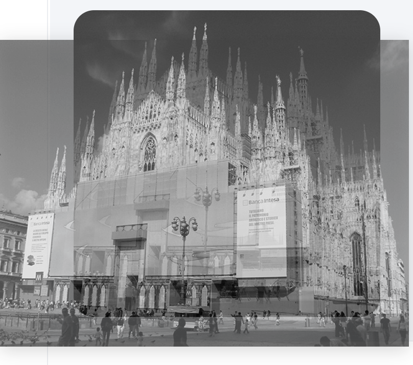

# 实验报告

姓名：	钟尹骏

学号：	19302010025

Github地址：				

Github Pages地址：	

## 项目完成情况

#### 1. 兼容性

在Chrome、Firefox和Safari上显示大概一致，除去选择框以及按钮边框差异

#### 2. 语言支持

能够正确支持中英文字符显示和输入，页面无乱码

#### 3. 要求完成情况

各页面基本需求均已完成且页面之间跳转无误

## Bonus完成情况

#### 更复杂的图片处理（已完成）

项目中所使用的图片均为自由版式，经过JavaScript调整后合理显示

**解决方式**

```html
function resizeAndReposition(width, height, id, flag) {
    const parent = document.getElementById(id);
    const img_group = parent.getElementsByTagName("img");

    for (let i = 0; i < img_group.length; i++) {
        const obj = img_group[i];
        let scale;
        if (flag) {
            scale = Math.max(height / obj.height, width / obj.width);
        } else {
            scale = Math.min(height / obj.height, width / obj.width);
        }
        obj.width = obj.width * scale;
        obj.style.top = (height - obj.height) / 2 + "px";
        obj.style.left = (width - obj.width) / 2 + "px";
    }
}
```

根据id找到父容器并设置其下所有图片大小，当flag为true，比例较小边变为父容器尺寸（表现为一个方向贴合，另一个溢出）为false时，比例较大边变为父容器尺寸（表现为一个方向贴合，另一个在内部）

**实例**



图片为横向，容器形状为正方形，因此高度匹配并显示图片居中部分，剩余隐藏